# 境界づけられたコンテキスト & コンテキストマップ

## 境界づけられたコンテキスト一覧

| # | コンテキスト | 責務 | コアドメイン度 |
|---|---|---|---|
| 1 | **Identity & Access** | 管理者認証、参加者認証、JWT発行、ロール判定 | 汎用 |
| 2 | **Event** | イベントのライフサイクル管理(準備中→進行中→終了) | サポート |
| 3 | **Member** | イベント内メンバーの登録・編集・一覧 | サポート |
| 4 | **Match Operation** | ラウンド・マッチ・チーム分け・得点記録 | **コア** |
| 5 | **MVP Evaluation** | Gemini AI 評価、レーティング、MVP/準MVP選出 | **コア** |
| 6 | **Survey** | アンケートフォーム管理、回答取得 | サポート |

### コア vs サポート の判断理由

- **Match Operation がコア**: チーム分けロジックと助っ人管理はこのアプリ独自の価値
- **MVP Evaluation がコア**: Gemini AIによる質的評価がサービスの差別化要素
- それ以外は汎用的な CRUD/認証

### 設計上のポイント

- **Match は独立集約** として Round と分離して管理する
- **Survey は Webフォームを自前実装**(Google Forms 依存なし)
- **SurveyResponse は独立集約** として Survey から分離
- コンテキスト境界の粒度は 6 つを維持

## コンテキスト間の関係

### 図

```mermaid
graph TD
    subgraph "Core Domains"
        MATCH[Match Operation]
        MVP[MVP Evaluation]
    end

    subgraph "Supporting"
        EVENT[Event]
        MEMBER[Member]
        SURVEY[Survey]
    end

    subgraph "Generic"
        IDENTITY[Identity &#38; Access]
    end

    IDENTITY -.JWT検証.-> EVENT
    IDENTITY -.JWT検証.-> MEMBER
    IDENTITY -.JWT検証.-> MATCH
    IDENTITY -.JWT検証.-> MVP
    IDENTITY -.JWT検証.-> SURVEY

    EVENT ==EventId発行==> MEMBER
    EVENT ==EventId発行==> MATCH
    EVENT ==EventId発行==> SURVEY
    EVENT ==EventId発行==> MVP

    MEMBER ==MemberId参照==> MATCH
    MEMBER ==MemberId参照==> MVP
    MEMBER ==MemberId参照==> SURVEY

    MATCH ==試合データ提供==> MVP
    SURVEY ==コメント提供==> MVP

    EVENT -.EventFinishedイベント.-> MVP
```



### 関係パターン (DDD 用語)

| Upstream | Downstream | パターン | 備考 |
|---|---|---|---|
| Identity & Access | 全コンテキスト | **Conformist** | 各コンテキストはIdentityが決めたJWT仕様に従う |
| Event | Member | **Customer/Supplier** | MemberはEventに強く依存。EventId がない限り存在できない |
| Event | Match Operation | **Customer/Supplier** | 同上 |
| Event | Survey | **Customer/Supplier** | 同上 |
| Event | MVP Evaluation | **Customer/Supplier** + ドメインイベント | `EventFinished` イベントでMVP選出可能状態を伝える |
| Match Operation | MVP Evaluation | **Open Host Service** | 試合データ取得用の公開クエリインターフェースを提供 |
| Survey | MVP Evaluation | **Open Host Service** | アンケートコメント取得用の公開クエリインターフェースを提供 |

### 設計ルール

1. **他コンテキストの集約を直接参照しない**
   - `MatchParticipant` は `Member` オブジェクトを持たず、`MemberId` のみを保持
   - MVP選出時は `MemberQueryService` のような公開インターフェース経由でメンバー情報を取得

2. **ドメインイベントはコンテキスト間の疎結合連携に使う**
   - 例: `EventFinished` → MVP選出可能フラグの更新
   - ただし同期処理で十分な場合は直接ユースケース呼び出しでもOK
   - 初期実装では同期のアプリケーションサービス呼び出しを優先(シンプルさ重視)

3. **共有カーネル (Shared Kernel) を最小限にする**
   - 共有は `EventId`, `MemberId` などの ID型、`DomainEvent` 基底型、例外基底型に限定
   - ドメインモデルそのものは共有しない

## モジュール配置 (Spring Boot)

```
com.salurec
├── shared                         ← Shared Kernel
│   ├── domain/                    DomainEvent, EntityId, DomainException
│   ├── infrastructure/            時計, UUID生成, イベントパブリッシャ
│   └── web/                       共通例外ハンドラ, レスポンス型
│
├── identity                       ← Bounded Context
│   ├── domain/                    Admin, EventAccessToken, Role
│   ├── application/               LoginAsAdminUseCase, LoginWithCodeUseCase
│   ├── infrastructure/            JwtTokenProvider, PasswordMatcher
│   └── presentation/              AuthController
│
├── event
│   ├── domain/                    Event, EventStatus, JoinCode, EventId
│   ├── application/               CreateEventUseCase, StartEventUseCase, ...
│   ├── infrastructure/            EventRepositoryImpl (JPA)
│   └── presentation/              EventController
│
├── member
├── match
├── mvp
└── survey
```

### 循環依存の防止

- `event` ← `member`, `match`, `survey`, `mvp` の一方向依存
- `match`, `survey` → `mvp` の一方向依存(MVPは全員を見るが、MVP自身は他に依存しない)
- パッケージ間の逆参照は Spring Modulith の `@ApplicationModule` + ArchUnit テストで強制する(将来検討)

## データ境界

RDBテーブルも同様にコンテキスト境界を尊重する。

| コンテキスト | 所有テーブル |
|---|---|
| Event | `events` |
| Member | `members` |
| Match Operation | `rounds`, `matches`, `match_participants`, `goals` |
| MVP Evaluation | `mvp_evaluations`, `mvp_player_ratings` |
| Survey | `surveys`, `survey_responses`, `survey_comments` |
| Identity & Access | (DBテーブル持たず。管理者パスワードは環境変数、参加トークンはJWTステートレス) |

**ルール**: 他コンテキストのテーブルに直接 JOIN してはいけない。
必要な場合はアプリケーション層で複数リポジトリを呼び出してマージする。
Read 側に限り、COUNT/EXISTS など集計用途のクロスコンテキスト参照を許容する(詳細は [backend-architecture.md](../backend/design/backend-architecture.md))。
