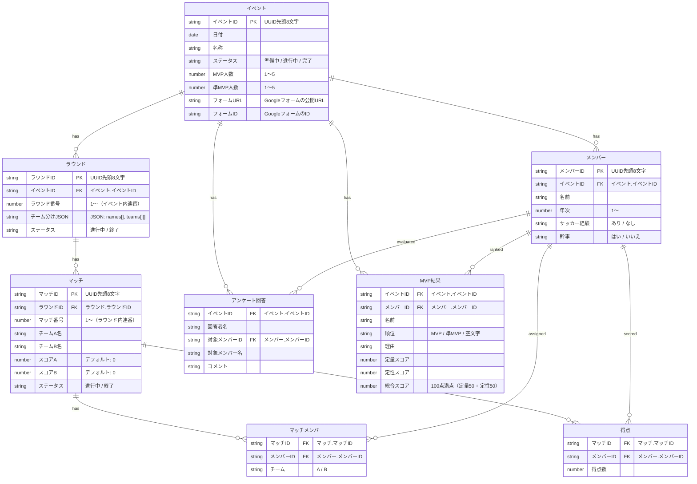

# フットサル管理システム ER図

## 概要

本システムは Google スプレッドシート上の8シートでデータを管理しています。
全てのデータはイベント単位で管理され、イベントを横断した集計は行いません。

## ER図（Mermaid）



## テーブル一覧

| # | シート名 | 説明 | PK |
|---|----------|------|----|
| 1 | イベント | フットサルイベント（日程・名称・設定） | イベントID |
| 2 | メンバー | イベントに参加するメンバー | メンバーID |
| 3 | ラウンド | チーム分けの単位（Nチーム） | ラウンドID |
| 4 | マッチ | ラウンド内の2チーム対戦 | マッチID |
| 5 | マッチメンバー | マッチに出場するメンバーとチーム割当 | (マッチID, メンバーID) |
| 6 | 得点 | マッチ内の個人得点記録 | (マッチID, メンバーID) |
| 7 | アンケート回答 | Googleフォーム経由のMVP評価コメント | (イベントID, 回答者名, 対象メンバーID) |
| 8 | MVP結果 | MVP選出の最終結果 | (イベントID, メンバーID) |

## リレーション詳細

| 親テーブル | 子テーブル | 外部キー | 関係 | 備考 |
|-----------|-----------|---------|------|------|
| イベント | メンバー | イベントID | 1:N | イベント削除時にカスケード削除 |
| イベント | ラウンド | イベントID | 1:N | イベント削除時にカスケード削除 |
| イベント | アンケート回答 | イベントID | 1:N | イベント削除時にカスケード削除 |
| イベント | MVP結果 | イベントID | 1:N | MVP再選出時に既存結果を削除して再作成 |
| ラウンド | マッチ | ラウンドID | 1:N | ラウンド削除時にカスケード削除 |
| マッチ | マッチメンバー | マッチID | 1:N | マッチ削除時にカスケード削除 |
| マッチ | 得点 | マッチID | 1:N | マッチ削除時にカスケード削除 |
| メンバー | マッチメンバー | メンバーID | 1:N | メンバーのチーム割当 |
| メンバー | 得点 | メンバーID | 1:N | 個人得点記録 |
| メンバー | アンケート回答 | 対象メンバーID | 1:N | 評価対象としての紐づけ |
| メンバー | MVP結果 | メンバーID | 1:N | MVP評価結果 |

## データの階層構造

```
イベント
├── メンバー
├── ラウンド（チーム分けの単位）
│   └── マッチ（2チーム対戦）
│       ├── マッチメンバー（出場メンバー × チーム割当）
│       └── 得点（個人得点記録）
├── アンケート回答（Googleフォーム経由）
└── MVP結果（定量50% + 定性50%の100点満点評価）
```

## 補足

- IDは全て `Utilities.getUuid().substring(0, 8)` で生成（8文字のUUID先頭部分）
- マッチメンバー・得点は明示的なPKカラムを持たず、複合キーで一意性を担保
- アンケート回答の取得時は既存データを全削除してから再取得する（冪等性を確保）
- MVP結果も再選出時に既存データを全削除してから再作成する
- スプレッドシート上にはRDBのような外部キー制約はないため、削除時はアプリケーション側でカスケード削除を実装
