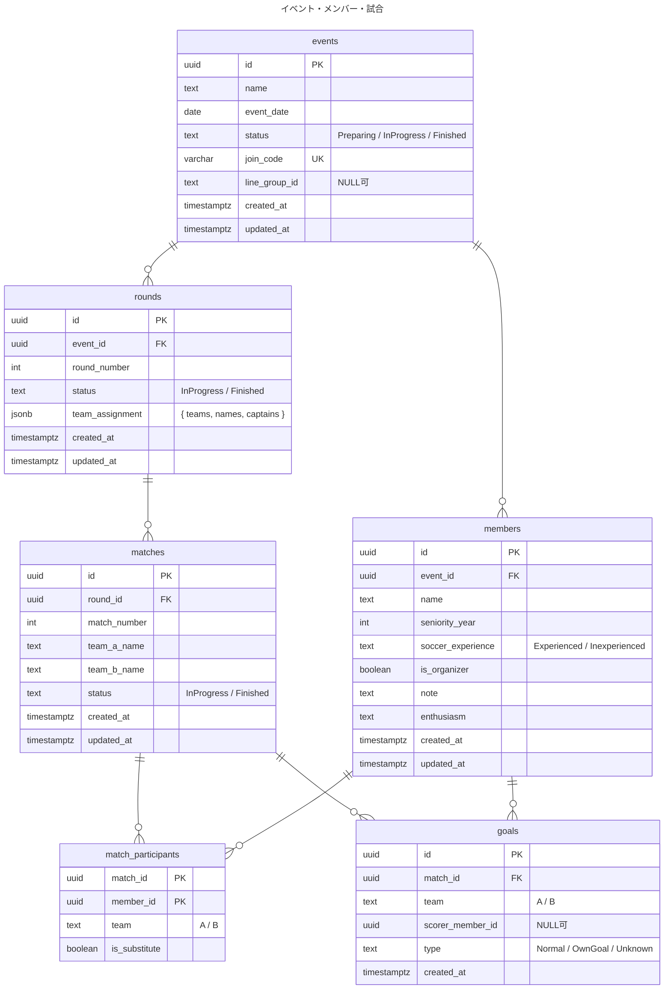
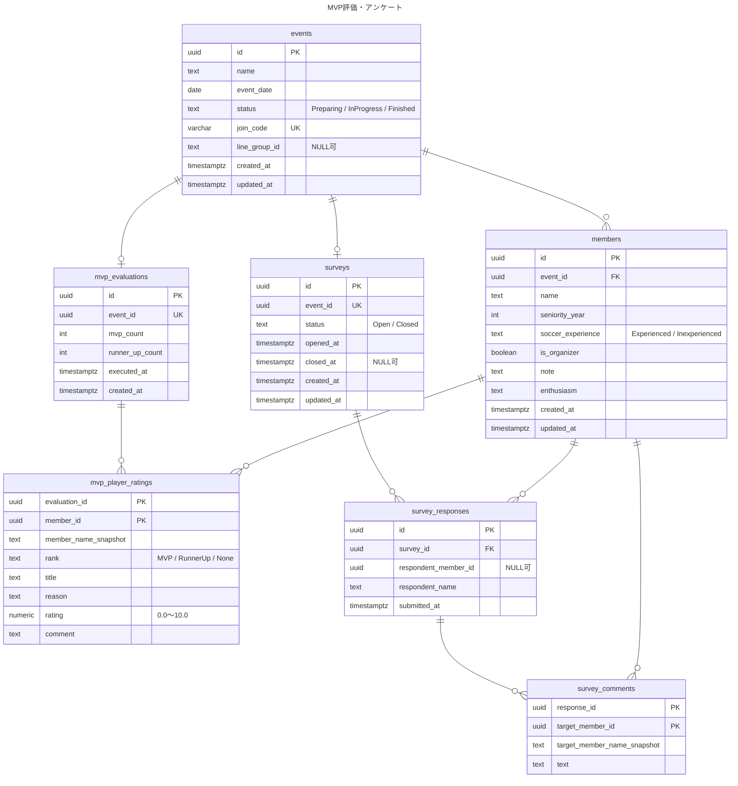

# Salu-Rec ER図

## ER図（Mermaid）

### イベント・メンバー・試合


```mermaid
---
title: イベント・メンバー・試合
---
erDiagram
    events {
        uuid id PK
        text name
        date event_date
        text status "Preparing / InProgress / Finished"
        varchar join_code UK
        text line_group_id "NULL可"
        timestamptz created_at
        timestamptz updated_at
    }

    members {
        uuid id PK
        uuid event_id FK
        text name
        int seniority_year
        text soccer_experience "Experienced / Inexperienced"
        boolean is_organizer
        text note
        text enthusiasm
        timestamptz created_at
        timestamptz updated_at
    }

    rounds {
        uuid id PK
        uuid event_id FK
        int round_number
        text status "InProgress / Finished"
        jsonb team_assignment "{ teams, names, captains }"
        timestamptz created_at
        timestamptz updated_at
    }

    matches {
        uuid id PK
        uuid round_id FK
        int match_number
        text team_a_name
        text team_b_name
        text status "InProgress / Finished"
        timestamptz created_at
        timestamptz updated_at
    }

    match_participants {
        uuid match_id PK
        uuid member_id PK
        text team "A / B"
        boolean is_substitute
    }

    goals {
        uuid id PK
        uuid match_id FK
        text team "A / B"
        uuid scorer_member_id "NULL可"
        text type "Normal / OwnGoal / Unknown"
        timestamptz created_at
    }

    events ||--o{ members : ""
    events ||--o{ rounds : ""
    rounds ||--o{ matches : ""
    matches ||--o{ match_participants : ""
    matches ||--o{ goals : ""
    members ||--o{ match_participants : ""
    members ||--o{ goals : ""
```

### MVP評価・アンケート


```mermaid
---
title: MVP評価・アンケート
---
erDiagram
    events {
        uuid id PK
        text name
        date event_date
        text status "Preparing / InProgress / Finished"
        varchar join_code UK
        text line_group_id "NULL可"
        timestamptz created_at
        timestamptz updated_at
    }

    members {
        uuid id PK
        uuid event_id FK
        text name
        int seniority_year
        text soccer_experience "Experienced / Inexperienced"
        boolean is_organizer
        text note
        text enthusiasm
        timestamptz created_at
        timestamptz updated_at
    }

    mvp_evaluations {
        uuid id PK
        uuid event_id UK
        int mvp_count
        int runner_up_count
        timestamptz executed_at
        timestamptz created_at
    }

    mvp_player_ratings {
        uuid evaluation_id PK
        uuid member_id PK
        text member_name_snapshot
        text rank "MVP / RunnerUp / None"
        text title
        text reason
        numeric rating "0.0〜10.0"
        text comment
    }

    surveys {
        uuid id PK
        uuid event_id UK
        text status "Open / Closed"
        timestamptz opened_at
        timestamptz closed_at "NULL可"
        timestamptz created_at
        timestamptz updated_at
    }

    survey_responses {
        uuid id PK
        uuid survey_id FK
        uuid respondent_member_id "NULL可"
        text respondent_name
        timestamptz submitted_at
    }

    survey_comments {
        uuid response_id PK
        uuid target_member_id PK
        text target_member_name_snapshot
        text text
    }

    events ||--o{ members : ""
    events ||--o| mvp_evaluations : ""
    events ||--o| surveys : ""
    mvp_evaluations ||--o{ mvp_player_ratings : ""
    members ||--o{ mvp_player_ratings : ""
    surveys ||--o{ survey_responses : ""
    members ||--o{ survey_responses : ""
    survey_responses ||--o{ survey_comments : ""
    members ||--o{ survey_comments : ""
```

---

## データの階層構造

```
events
├── members
├── rounds
│   └── matches
│       ├── match_participants
│       └── goals
├── mvp_evaluations（1イベントに最大1件）
│   └── mvp_player_ratings
└── surveys（1イベントに最大1件）
    └── survey_responses
        └── survey_comments
```

---

## テーブル定義

### events

| カラム | 型 | 制約 | 説明 |
|---|---|---|---|
| id | UUID | PK | |
| name | TEXT | NOT NULL, 1〜100文字 | イベント名 |
| event_date | DATE | NOT NULL | 開催日 |
| status | TEXT | NOT NULL | Preparing / InProgress / Finished |
| join_code | VARCHAR(5) | NOT NULL, UNIQUE | 参加コード |
| line_group_id | TEXT | NULL | LINE Messaging API のグループID |
| created_at | TIMESTAMPTZ | NOT NULL, DEFAULT now() | |
| updated_at | TIMESTAMPTZ | NOT NULL, DEFAULT now() | |

### members

| カラム | 型 | 制約 | 説明 |
|---|---|---|---|
| id | UUID | PK | |
| event_id | UUID | NOT NULL, FK → events(id) CASCADE | 所属イベント |
| name | TEXT | NOT NULL, 1〜50文字 | メンバー名 |
| seniority_year | INT | NOT NULL, >= 1 | 年次 |
| soccer_experience | TEXT | NOT NULL | Experienced / Inexperienced |
| is_organizer | BOOLEAN | NOT NULL, DEFAULT FALSE | 幹事フラグ |
| note | TEXT | NOT NULL, DEFAULT '' | 備考 |
| enthusiasm | TEXT | NOT NULL, DEFAULT '', <= 50文字 | 意気込み |
| created_at | TIMESTAMPTZ | NOT NULL, DEFAULT now() | |
| updated_at | TIMESTAMPTZ | NOT NULL, DEFAULT now() | |

### rounds

| カラム | 型 | 制約 | 説明 |
|---|---|---|---|
| id | UUID | PK | |
| event_id | UUID | NOT NULL, FK → events(id) CASCADE | 所属イベント |
| round_number | INT | NOT NULL, UNIQUE(event_id, round_number) | イベント内連番 |
| status | TEXT | NOT NULL | InProgress / Finished |
| team_assignment | JSONB | NOT NULL | チーム分け情報（構造は後述） |
| created_at | TIMESTAMPTZ | NOT NULL, DEFAULT now() | |
| updated_at | TIMESTAMPTZ | NOT NULL, DEFAULT now() | |

#### team_assignment JSONB 構造

```json
{
  "names": ["チームA", "チームB"],
  "teams": [["memberId1", "memberId2"], ["memberId3", "memberId4"]],
  "captains": ["memberId1", "memberId3"]
}
```

| フィールド | 型 | 説明 |
|---|---|---|
| names | string[] | チーム名の配列 |
| teams | string[][] | チームごとのメンバーID配列 |
| captains | string[] | 各チームのキャプテンのメンバーID配列 |

### matches

| カラム | 型 | 制約 | 説明 |
|---|---|---|---|
| id | UUID | PK | |
| round_id | UUID | NOT NULL, FK → rounds(id) CASCADE | 所属ラウンド |
| match_number | INT | NOT NULL, UNIQUE(round_id, match_number) | ラウンド内連番 |
| team_a_name | TEXT | NOT NULL, 1〜10文字 | チームA名 |
| team_b_name | TEXT | NOT NULL, 1〜10文字 | チームB名 |
| status | TEXT | NOT NULL | InProgress / Finished |
| created_at | TIMESTAMPTZ | NOT NULL, DEFAULT now() | |
| updated_at | TIMESTAMPTZ | NOT NULL, DEFAULT now() | |

### match_participants

| カラム | 型 | 制約 | 説明 |
|---|---|---|---|
| match_id | UUID | PK, FK → matches(id) CASCADE | 所属マッチ |
| member_id | UUID | PK, FK → members(id) | メンバー |
| team | TEXT | NOT NULL | A / B |
| is_substitute | BOOLEAN | NOT NULL, DEFAULT FALSE | 助っ人フラグ |

### goals

| カラム | 型 | 制約 | 説明 |
|---|---|---|---|
| id | UUID | PK | |
| match_id | UUID | NOT NULL, FK → matches(id) CASCADE | 所属マッチ |
| team | TEXT | NOT NULL | A / B（得点チーム） |
| scorer_member_id | UUID | NULL可, FK → members(id) | 得点者 |
| type | TEXT | NOT NULL | Normal / OwnGoal / Unknown |
| created_at | TIMESTAMPTZ | NOT NULL, DEFAULT now() | |

**CHECK**: Normal → scorer_member_id 必須 / OwnGoal, Unknown → scorer_member_id NULL

### mvp_evaluations

| カラム | 型 | 制約 | 説明 |
|---|---|---|---|
| id | UUID | PK | |
| event_id | UUID | NOT NULL, UNIQUE, FK → events(id) | 1イベントに1件 |
| mvp_count | INT | NOT NULL, 1〜5 | MVP人数 |
| runner_up_count | INT | NOT NULL, 1〜5 | 準MVP人数 |
| executed_at | TIMESTAMPTZ | NOT NULL | 選出実行日時 |
| created_at | TIMESTAMPTZ | NOT NULL, DEFAULT now() | |

### mvp_player_ratings

| カラム | 型 | 制約 | 説明 |
|---|---|---|---|
| evaluation_id | UUID | PK, FK → mvp_evaluations(id) CASCADE | 所属評価 |
| member_id | UUID | PK, FK → members(id) | メンバー |
| member_name_snapshot | TEXT | NOT NULL | 選出時点の名前 |
| rank | TEXT | NOT NULL | MVP / RunnerUp / None |
| title | TEXT | NOT NULL, DEFAULT '' | 称号 |
| reason | TEXT | NOT NULL, DEFAULT '' | 選出理由（MVP/準MVPのみ） |
| rating | NUMERIC(3,1) | NOT NULL, 0.0〜10.0 | 10段階評価 |
| comment | TEXT | NOT NULL, DEFAULT '' | 本人へのメッセージ |

### surveys

| カラム | 型 | 制約 | 説明 |
|---|---|---|---|
| id | UUID | PK | |
| event_id | UUID | NOT NULL, UNIQUE, FK → events(id) | 1イベントに1件 |
| status | TEXT | NOT NULL | Open / Closed |
| opened_at | TIMESTAMPTZ | NOT NULL | 受付開始日時 |
| closed_at | TIMESTAMPTZ | NULL可 | 締切日時 |
| created_at | TIMESTAMPTZ | NOT NULL, DEFAULT now() | |
| updated_at | TIMESTAMPTZ | NOT NULL, DEFAULT now() | |

### survey_responses

| カラム | 型 | 制約 | 説明 |
|---|---|---|---|
| id | UUID | PK | |
| survey_id | UUID | NOT NULL, FK → surveys(id) CASCADE | 所属アンケート |
| respondent_member_id | UUID | NULL可, FK → members(id), UNIQUE(survey_id, respondent_member_id) | 回答者（匿名時NULL） |
| respondent_name | TEXT | NOT NULL | 回答者名 |
| submitted_at | TIMESTAMPTZ | NOT NULL | 回答日時 |

### survey_comments

| カラム | 型 | 制約 | 説明 |
|---|---|---|---|
| response_id | UUID | PK, FK → survey_responses(id) CASCADE | 所属回答 |
| target_member_id | UUID | PK, FK → members(id) | 評価対象メンバー |
| target_member_name_snapshot | TEXT | NOT NULL | 対象メンバー名（スナップショット） |
| text | TEXT | NOT NULL, DEFAULT '' | コメント本文 |

---

## リレーション

| 親テーブル | 子テーブル | 外部キー | 関係 | 削除時 |
|---|---|---|---|---|
| events | members | event_id | 1:N | CASCADE |
| events | rounds | event_id | 1:N | CASCADE |
| events | mvp_evaluations | event_id | 1:1 | — |
| events | surveys | event_id | 1:1 | — |
| rounds | matches | round_id | 1:N | CASCADE |
| matches | match_participants | match_id | 1:N | CASCADE |
| matches | goals | match_id | 1:N | CASCADE |
| members | match_participants | member_id | 1:N | — |
| members | goals | scorer_member_id | 1:N | — |
| mvp_evaluations | mvp_player_ratings | evaluation_id | 1:N | CASCADE |
| members | mvp_player_ratings | member_id | 1:N | — |
| surveys | survey_responses | survey_id | 1:N | CASCADE |
| members | survey_responses | respondent_member_id | 1:N | — |
| survey_responses | survey_comments | response_id | 1:N | CASCADE |
| members | survey_comments | target_member_id | 1:N | — |

---

## インデックス

| テーブル | インデックス名 | カラム |
|---|---|---|
| events | idx_events_join_code | join_code |
| events | idx_events_status | status |
| members | idx_members_event_id | event_id |
| rounds | idx_rounds_event_id | event_id |
| matches | idx_matches_round_id | round_id |
| matches | idx_matches_status | status |
| match_participants | idx_match_participants_member_id | member_id |
| goals | idx_goals_match_id | match_id |
| mvp_player_ratings | idx_mvp_player_ratings_evaluation_id | evaluation_id |
| survey_responses | idx_survey_responses_survey_id | survey_id |
| survey_comments | idx_survey_comments_target_member_id | target_member_id |
